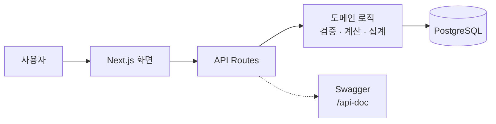
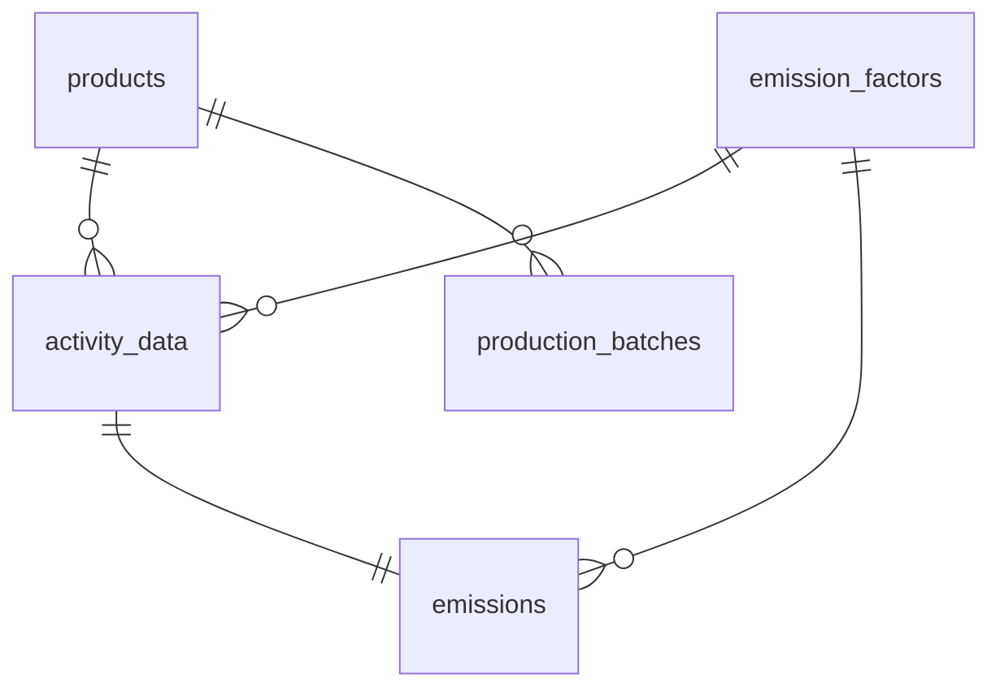
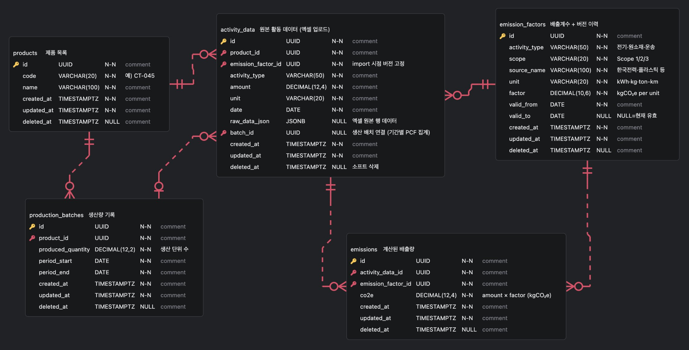

# 탄소 관리 플랫폼 — PCF 대시보드

제품별 탄소 발자국(PCF)을 자동 계산하고 시각화하는 인터랙티브 대시보드.

## 목차

- [시스템 설계](#시스템-설계)
  - [아키텍처](#아키텍처)
  - [DB 스키마 ERD](#db-스키마-erd)
  - [페이지 구성](#페이지-구성)
- [기술 스택](#기술-스택)
- [로컬 실행 방법](#로컬-실행-방법)
  - [Docker Compose](#docker-compose)
  - [Yarn](#yarn)
- [스크린샷 / 데모](#스크린샷--데모)
- [AI 활용 내역](#ai-활용-내역)
- [회고 및 개선 방향](#회고-및-개선-방향)

---

## 시스템 설계

### 아키텍처



Next.js App Router 안에서 화면과 API Route를 함께 구성
실무자 화면은 엑셀 업로드와 검증을 담당
경영자 화면은 저장된 데이터를 집계해 PCF·Scope·월별 추이를 표현

Docker Compose는 `app`과 `db` 두 컨테이너로 구성
`app` 시작 시 Prisma가 PostgreSQL 스키마를 동기화하고, API 문서는 `/api-doc`에서 확인할 수 있습니다.


### DB 스키마 (ERD)

활동 데이터, 배출계수, 계산 결과를 분리.
배출계수는 버전 이력이 필요하고, 계산 결과는 대시보드 조회 성능을 위해 별도 저장



> 상세 ERD: [`schema.vuerd.json`](./schema.vuerd.json) — ERD Editor(dineug) VSCode 확장 필요.


| 테이블 | 역할 |
|--------|------|
| `products` | 제품 목록 |
| `emission_factors` | 배출계수 + **버전 이력** (valid_from/valid_to) |
| `activity_data` | 엑셀 업로드 원본 데이터 (raw_data_json 포함) |
| `emissions` | 계산된 배출량 (amount × factor) |
| `production_batches` | 생산량 기록 → 단위당 PCF 분모 |


### 페이지 구성

| 경로 | 대상 | 주요 기능 |
|------|------|-----------|
| `/` | 경영자 | 연도별 PCF 요약 KPI, 월별 배출량, 배출원 비중, 제품·배출원별 PCF 상세, 전월·전년 대비 추이 |
| `/operator` | 실무자 | 엑셀 업로드, 컬럼 매핑, 유효성 검사, 오류 행 수정, DB 반영, 배출계수 버전 추가·조회 |

---

## 기술 스택

Next.js · TypeScript · Prisma · PostgreSQL · Tailwind CSS · shadcn/ui · Recharts · Zod · TanStack Table · next-swagger-doc · Docker Compose

### 선정 근거

**shadcn/ui**: npm 패키지가 아닌 소스코드 직접 복사 방식 → 커스터마이징 자유로움  
**Recharts**: React 선언적 방식으로 차트 작성. D3 대비 러닝커브 낮고 React 친화적  
**Prisma**: 스키마 기반으로 DB 구조와 TypeScript 타입이 자동 동기화  
**PostgreSQL (Docker Compose)**: NeonDB 를 쓰고 싶었으나 `docker-compose` 사용 시 보너스가 있다하여..
**Zod**: 엑셀 파싱 결과 검증, 날짜 포맷·단위 불일치 방어  
**TanStack Table**: 대용량 데이터 대응
**next-swagger-doc**: API Route 주석 기반으로 OpenAPI 3.0 스펙 자동 생성

---


## 로컬 실행 방법

### Docker Compose

```bash
# 저장소 클론
git clone https://github.com/croot-dev/pcf-dashboard && cd pcf-dashboard

# PostgreSQL + Next.js 앱 실행
docker compose up --build
```

접속: http://localhost:3000

기본값으로 바로 실행되도록 구성되어 있어 `.env` 파일은 없어도 됩니다. hot reload가 필요하거나 포트, DB 계정명을 바꾸고 싶을 때만 `.env.example`을 복사해 수정하세요.

```bash
cp .env.example .env
```

개발 중 hot reload가 필요하면 `.env`에 `NODE_ENV=development`를 설정한 뒤 실행합니다.

```bash
docker compose up --build
```

초기 샘플 데이터가 필요하면 최초 실행 시에만 `SEED_DB=true`를 붙입니다.

```bash
SEED_DB=true docker compose up --build
```

컨테이너 시작 시 Prisma가 자동으로 `prisma db push`를 실행해 DB 스키마를 동기화합니다. Docker Compose 실행 시에는 `docker-compose.yml`에서 앱 컨테이너용 `DATABASE_URL`을 주입합니다.

### Yarn

Node.js 22.x와 Yarn 1.x 기준입니다. 앱은 로컬에서 실행하고 PostgreSQL만 Docker Compose로 띄웁니다. Prisma는 `prisma.config.ts`에서 `.env`를 읽고, `DATABASE_URL`이 없으면 `DB_USER`, `DB_PASSWORD`, `DB_HOST`, `DB_PORT`, `DB_NAME`으로 연결 URL을 만듭니다.

```bash
# PostgreSQL 실행
docker compose up -d db

# 환경 변수 파일 생성
cp .env.example .env

# 의존성 설치
yarn install --frozen-lockfile

# DB 스키마 동기화 및 Prisma Client 생성
yarn db:push && yarn db:generate

# 개발 서버 실행
yarn dev
```

접속: http://localhost:3000

production 실행을 확인하려면 아래처럼 빌드 후 시작합니다.

```bash
yarn build
yarn start
```

초기 샘플 데이터가 필요하면 `yarn db:seed`를 한 번 실행합니다.

---

## 스크린샷 / 데모

UI 실행 과정과 비디오 캡처 순서는 [UI 실행 과정](./docs/ui-demo-guide.md)에 정리했습니다.

### 경영자 대시보드

연도별 총 배출량, 단위 PCF, Scope별 월별 추이, 배출원 비중, 배출원별 PCF 상세를 한 화면에서 확인합니다.


### 실무자 대시보드

엑셀 업로드, 컬럼 매핑, 유효성 검사, 오류 행 수정, 배출계수 버전 관리를 한 흐름으로 처리합니다.


### 엑셀 임포트 화면

과제용 Excel 데이터를 업로드한 뒤 매핑과 검증 결과를 확인하고, 정상 데이터만 DB에 반영합니다.


---

## AI 활용 내역

빠르게 초안을 만들 수 있는 영역과 검증에 집중적으로 활용

- 탄소 회계 용어와 PCF 계산 흐름 정리
- 경영자/실무자 관점의 인사이트 있는 대시보드 후보 도출
- API 응답 구조, Swagger 주석, 테스트 데이터 생성
- Claude Design을 활용한 초기 디자인 시스템 방향 탐색
- README 체크리스트 누락 여부 점검

조금 더 상세한 AI 활용 내역은 ["./docs/ai-used.md"](./docs/ai-used.md)에 정리했습니다.

---

## 회고 및 개선 방향

오랜만의 대시보드 작업 재미있었습니다. :)
초기에는 탄소 회계 도메인에 대한 이해가 충분하지 않은 상태에서 화면과 DB 스키마를 먼저 설계했습니다. 그 결과 스키마 구조가 좀 이상하게 되었고, 경영자 대시보드 역시 PCF 지표와 Scope별 해석이 부족하다는 점을 뒤늦게 파악했습니다.

이후 PCF 계산 흐름과 사용자 관점을 다시 정리하면서 DB 스키마와 경영자 대시보드를 전면 수정했습니다. 이 과정에서 도메인 이해가 설계 품질에 직접적인 영향을 준다는 점을 크게 느꼈습니다.

**추가 개선 방향**
- 사용자 관점별 필터 세분화
- Scope별 상세 View 고도화
- 동적 위젯 기반 대시보드 확장
- 리포트 PDF/CSV 내보내기
