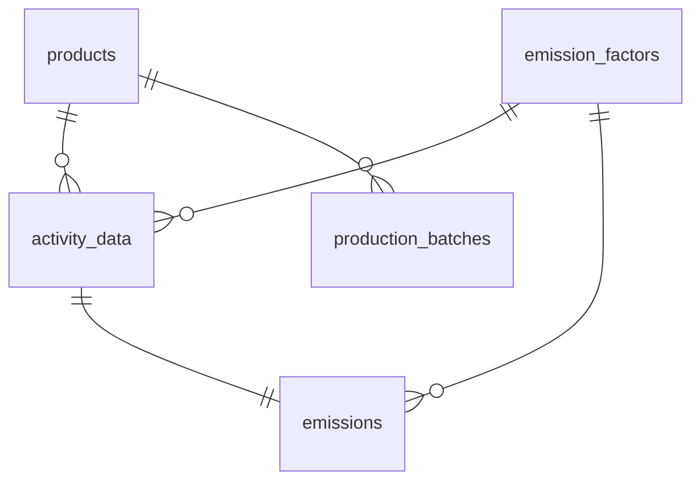

# 탄소 관리 플랫폼 — PCF 대시보드

제조사·물류사 등 기업 고객이 원소재·전기·운송 데이터를 입력하면 제품별 탄소 발자국(PCF)을 자동 계산하고 시각화하는 인터랙티브 대시보드.

---

## 용어 정의

**CO₂eq** — 모든 온실가스를 CO₂ 기준으로 환산한 단위. PCF는 항상 `kg CO₂eq` 로 표현.

**PCF (Product Carbon Footprint)** — 제품 1단위 생산~폐기 전 과정의 온실가스 총량.  
ISO 14067 / System Boundary: Cradle-to-Gate

**GHG Scope** — 배출원을 통제 범위에 따라 3단계로 분류하는 GHG Protocol 기준.
- **Scope 1**: 직접 배출 — 사업장 내 연소, 사내 차량
- **Scope 2**: 간접 배출 — 구매 전력·열
- **Scope 3**: 가치사슬 전체 — 원소재 조달, 제품 운송, 고객 사용 (통상 전체의 ~85%)

**배출계수 (Emission Factor)** — 활동 1단위당 배출량. 공인 기관이 산업·지역별로 제공.  
예) 한국 전력: `0.4567 kg CO₂eq/kWh`

**LCA (Life Cycle Assessment)** — 원료 채취→생산→운송→사용→폐기 전 과정의 환경 영향 평가.

---

## 시스템 설계

### 아키텍처

```
Browser
  └─ Next.js App Router (Vercel / Docker)
       ├─ /app          → React 페이지 (RSC + Client)
       ├─ /app/api      → API Routes (엑셀 파싱·계산·저장)
       └─ Prisma ORM
            └─ PostgreSQL (Docker Compose)
```

### 설계 고려사항

1. emission_factors를 별도 테이블로 분리 + 버전 이력 관리
  - 배출계수는 정부·기관이 주기적으로 갱신.
  - 계수를 activity_data에 직접 박으면 과거 데이터 재현이 불가능
  - `valid_from` / `valid_to` 컬럼으로 시점별 계수를 추적, import 시점의 계수 ID를 `activity_data`에 고정 저장.

2. emissions 테이블에 계산 결과를 사전 저장 (pre-computed)
  - 대시보드 조회마다 `amount × factor`를 실시간 계산하면 성능 리스크  
  - import 시점에 API Route에서 계산 후 저장. 조회는 단순 SELECT + SUM.

3. raw_data_json 보관
  - 파싱 실패 시 원본을 재처리 필요성 고려...  
  - 엑셀 행 전체를 JSONB로 보관해 언제든 재파싱 및 디버깅 가능.


### DB 스키마 (ERD)

> 상세 ERD: [`schema.vuerd.json`](./schema.vuerd.json) — ERD Editor(dineug) VSCode 확장으로 열기



| 테이블 | 역할 |
|--------|------|
| `products` | 제품 목록 |
| `emission_factors` | 배출계수 + **버전 이력** (valid_from/valid_to) |
| `activity_data` | 엑셀 업로드 원본 데이터 (raw_data_json 포함) |
| `emissions` | 계산된 배출량 (amount × factor) |
| `production_batches` | 생산량 기록 → 단위당 PCF 분모 |


### 페이지 구성안

```
/            경영자 대시보드
               · PCF 요약 KPI 카드 (단위: kgCO₂e/개)
               · Scope별 배출량 파이차트 (비율 + 절댓값 툴팁)
               · 월별 배출량 트렌드 차트 (Recharts LineChart)

/data        실무자 데이터 관리
               · 엑셀 업로드 → DB 자동 임포트
               · 활동 데이터 테이블 (pagination · sorting · filtering)
               · 오류 행 목록 + 에러 메시지 표시

/settings    배출계수 관리
               · 계수 목록 + 버전 이력 조회
```

### 엑셀 임포트 흐름

```
파일 선택 -> 시트 및 컬럼 매핑 확인
  -> [검증] 유효성 검사 및 DB 중복 대조
  -> [미리보기] 정상, 중복(Conflict), 오류 행 분류
  -> [사용자 결정] 중복 데이터 업데이트 여부 선택
  -> [반영] 최종 임포트 및 결과 리포트 출력
```

- 중복 처리 (Conflict Resolution): 단순 skip 대신 '기존 데이터 업데이트' 옵션을 제공해 실무자 실수 방지 및 데이터 최신성 유지.
- 행별 정밀 검증: 날짜 포맷, 필수값 누락, 미등록 단위를 필터링하여 구체적인 에러 메시지 제공.
- 데이터 추적성: 임포트 시점의 배출계수 버전 고정(Snapshot) 및 원본 JSONB 보관으로 계산 근거 확보.

### 계산 로직

```
emissions.co2e = activity_data.amount × emission_factors.factor
PCF (kgCO₂e/개) = SUM(emissions.co2e) / production_batches.produced_quantity
```

API Route에서 계산 후 DB 저장. 대시보드는 저장된 값을 조회 (계산 로직 중복 없음).  
모든 수치는 `kgCO₂e` 단위로 표시하며, 소수점 2자리 포맷팅 적용.

---

## 기술 스택

Next.js · TypeScript · Prisma · PostgreSQL · Tailwind CSS · shadcn/ui · Recharts · Zod · TanStack Table · next-swagger-doc · Docker Compose

### 선정 근거

**shadcn/ui**: npm 패키지가 아닌 소스코드 직접 복사 방식 → 커스터마이징 자유로움  
**Recharts**: React 선언적 방식으로 차트 작성. D3 대비 러닝커브 낮고 React 친화적  
**Prisma**: 스키마 기반으로 DB 구조와 TypeScript 타입이 자동 동기화  
**PostgreSQL (Docker Compose)**: NeonDB 를 쓰고 싶었으나 `docker-compose` 사용 시 보너스가 있다하여..
**Zod**: 엑셀 파싱 결과 검증, 날짜 포맷·단위 불일치 방어  
**TanStack Table**: 대용량 데이터 대응
**next-swagger-doc**: API Route 주석 기반으로 OpenAPI 3.0 스펙 자동 생성

---


## 로컬 실행 방법

환경 구분은 `.env`의 `NODE_ENV`로 제어합니다. `.env`가 없으면 production으로 동작합니다.

### Docker (개발)

```bash
# 저장소 클론
git clone https://github.com/croot-dev/pcf-dashboard && cd pcf-dashboard

# 환경 변수 설정
cp .env.example .env
# .env 열어서 NODE_ENV=development 로 변경

# 빌드 및 기동 (PostgreSQL + Next.js dev 서버)
docker-compose up --build
# → http://localhost:3000 (hot-reload 활성화)
```

### Docker (운영)

```bash
# .env 없이 실행하거나, NODE_ENV=production 으로 설정
docker-compose up --build
# → http://localhost:3000 (production 빌드)
```

---

## 대시보드 구성안

### 경영자
1. Current
  - 누적 총 CO₂e (kgCO₂e) — 가장 크게 강조
  - 평균 단위당 PCF (kgCO₂e/개) — 핵심 경영 지표
  - 최근 업데이트: 마지막 데이터 임포트 시점 + 총 레코드 수

2. Trend & Comparison
  - 월별 배출량 추이 라인차트 (CO₂e + 생산량 이중 축 오버레이)
  - 제품별 단위당 PCF 수평 바차트 (높은 순 정렬)
  - 전월 대비 증감률 (%) + 상승/하락 인디케이터

3. Hotspot
  - 배출원 TOP 3: 활동 유형별(전기/운송/원소재 등) CO₂e 기여도 수평 바차트
  - Scope 1/2/3 비중: 도넛차트 (호버 시 절댓값 툴팁)
  - 고배출 제품 리스트: 단위당 PCF 상위 제품 테이블 (전월 대비 증감 컬럼 포함)


---

## 스크린샷 / 데모

> 구현 완료 후 추가 예정

---

## 개발 로그

### Day 1

- 도메인 학습 및 용어 정리
- 과제 데이터 분석 및 구현 계획 수립
- DB 스키마 설계 (ERD Editor)
- 초기 프로젝트 구조 작성

### Day 2

---

## 작업 시간 기록

| 항목 | 소요 시간 |
|------|----------|
| 도메인 학습 및 설계 | .5 M/D |
| 프로젝트 세팅 | .5 M/D |
| 대시보드 기획 | - |
| API/UI 구현 | - |

| **총계** | - |

**시간이 많이 소요된 부분**: (완료 후 기록)

---

## AI 활용 내역

### 요구분석 및 도메인 학습

**작업내용**
- 도메인 컨텍스트 분석: 탄소발자국 및 PCF 등 비즈니스 핵심 용어 관련 지식 습득.
- 요구분석: 데이터 수집부터 계산, 리포팅까지 이어지는 기능적 요구사항 구체화.

**Prompt 예시**
- "PCF 산출 시스템 설계 전, 제품 단위 배출량 계산에 반드시 반영되어야 할 변수와 국내외 공시 기준에서 요구하는 데이터 무결성 요건을 정리해 줘."
- "실무자가 엑셀로 데이터를 관리할 때 발생하는 가장 빈번한 오류 유형들을 나열하고, 이를 요구사항 명세에 어떻게 반영할지 제안해 줘."

**결정근거**
- 분석의 정밀도 향상: 생소한 도메인 지식을 빠르게 구조화하여 요구분석 단계에서 발생할 수 있는 지식의 공백을 선제적으로 보완.
- 비즈니스 타당성 검토: AI와의 질의응답을 통해 도메인 전문가의 시각에서 설계를 검토함으로써, 실제 비즈니스 가치가 있는 유효 요구사항 선별.

### 시스템 설계 및 기술스택 선정

**작업내용**
- 기술 스택 후보군 교차 검증: 기술 호환성 및 설정 리스크 검토 지시.
- DB 스키마 베이스라인 생성: 탄소 회계 도메인에 필요한 기본 테이블 구조에 대한 초안 가이드 생성 및 성능 검증.
- 기술 스택 전략 수립: 기능 구현 범위 지정 및 과제 요구사항에 맞는 초기 파일구조 자동 생성

**Prompt 활용 전략**
- README.md 파일을 기반으로 프로젝트 개발 환경을 구축 해주고 라이브러리 간 버전 충돌 가능성이나 컨테이너 빌드 최적화 측면에서 주의해야 할 체크리스트를 알려줘"
- 도메인 모델링 베이스라인 요청: "PCF 산출을 위해 제품, 활동 데이터, 배출계수 간의 관계를 정의하는 스키마 초안을 작성"
- 스캐폴딩 및 범위 구체화: "주어진 과제 요구사항을 바탕으로 적절한 스케일의 폴더 구조 제안 및 보일러플레이트 작성"

**결정 근거**
- 인프라 리스크 사전 차단: 직접 선정한 기술 스택의 잠재적 결함(Connection Leak, 컨테이너 오버헤드 등)을 AI로 교차 검증하여 환경 구축 시간을 단축하고 운영 안정성 확보.
- 데이터 설계의 확장성 확보: AI가 제안한 기초 뼈대를 바탕으로 버전 관리와 원본 데이터 보존 등 실무적 세부 사항을 직접 덧붙여 도메인에 최적화된 DB 구조 확립.
- 개발 생산성 극대화: 프로젝트 초기 설정 및 폴더 구조 생성 등 반복적인 보일러플레이트 작업을 자동화하고, 구현 범위에 대한 객관적 우선순위를 검토하여 제한된 시간 내 고품질 산출물 도출.


### 경영자 대시보드 기획
```
## 프로젝트 개요
탄소 발자국(PCF) 관리 SaaS의 경영자용 대시보드 페이지를 디자인해줘.
제조사·물류사 기업 고객이 제품별 탄소 배출량을 파악하고 의사결정하는 화면이야.

## 기술 스택
Next.js, TypeScript, Tailwind CSS, shadcn/ui, Recharts

## 페이지 구조
단일 페이지에 아래 3개 섹션이 세로로 흐르는 레이아웃.
상단에 기간 필터(월/분기/연도 선택)가 고정되어 있고, 필터 변경 시 전 섹션 연동.

---

### 섹션 1 — 현재 (Current Status)
"지금 우리 수준은?"

KPI 카드 3개 가로 배열:
- 누적 총 CO₂e (kgCO₂e) — 가장 크게 강조
- 평균 단위당 PCF (kgCO₂e/개) — 핵심 경영 지표
- 최근 업데이트: 마지막 데이터 임포트 시점 + 총 레코드 수

---

### 섹션 2 — 비교 (Trend & Comparison)
"잘하고 있나?"

차트 2개:
- 월별 배출량 추이 라인차트 (CO₂e + 생산량 이중 축 오버레이)
- 제품별 단위당 PCF 수평 바차트 (높은 순 정렬)

카드 1개:
- 전월 대비 증감률 (%) + 상승/하락 인디케이터

---

### 섹션 3 — 분석 (Risk & Hotspot)
"어디에 집중해야 하나?"

- 배출원 TOP 3: 활동 유형별(전기/운송/원소재 등) CO₂e 기여도 수평 바차트
- Scope 1/2/3 비중: 도넛차트 (호버 시 절댓값 툴팁)
- 고배출 제품 리스트: 단위당 PCF 상위 제품 테이블 (전월 대비 증감 컬럼 포함)

---

## 디자인 방향
- 데이터 중심의 깔끔한 대시보드. 화려함보다 가독성 우선.
- 경영자가 30초 안에 현황을 파악할 수 있어야 함.
- 증가(악화)는 빨간색, 감소(개선)는 초록색으로 일관되게 표현.
- 탄소/환경 도메인이지만 그린워싱 느낌의 초록 테마는 피할 것.
- 라이트 모드 기준. shadcn/ui 컴포넌트 최대한 활용.
```