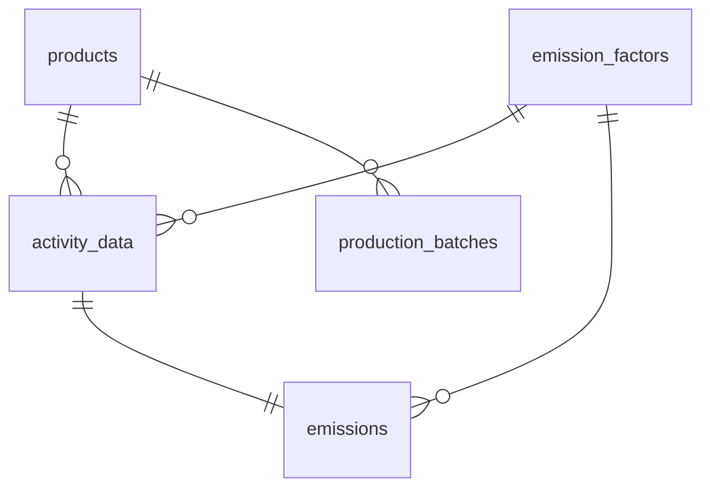

# 탄소 관리 플랫폼 — PCF 대시보드

제조사·물류사 등 기업 고객이 원소재·전기·운송 데이터를 입력하면 제품별 탄소 발자국(PCF)을 자동 계산하고 시각화하는 인터랙티브 대시보드.

---

## 용어 정의

**CO₂eq** — 모든 온실가스를 CO₂ 기준으로 환산한 단위. PCF는 항상 `kg CO₂eq` 로 표현.

**PCF (Product Carbon Footprint)** — 제품 1단위 생산~폐기 전 과정의 온실가스 총량.  
ISO 14067 / System Boundary: Cradle-to-Gate

**GHG Scope** — 배출원을 통제 범위에 따라 3단계로 분류하는 GHG Protocol 기준.
- **Scope 1**: 직접 배출 — 사업장 내 연소, 사내 차량
- **Scope 2**: 간접 배출 — 구매 전력·열
- **Scope 3**: 가치사슬 전체 — 원소재 조달, 제품 운송, 고객 사용 (통상 전체의 ~85%)

**배출계수 (Emission Factor)** — 활동 1단위당 배출량. 공인 기관이 산업·지역별로 제공.  
예) 한국 전력: `0.4567 kg CO₂eq/kWh`

**LCA (Life Cycle Assessment)** — 원료 채취→생산→운송→사용→폐기 전 과정의 환경 영향 평가.

---

## 시스템 설계

### 아키텍처

```
Browser
  └─ Next.js App Router (Vercel / Docker)
       ├─ /app          → React 페이지 (RSC + Client)
       ├─ /app/api      → API Routes (엑셀 파싱·계산·저장)
       └─ Prisma ORM
            └─ PostgreSQL (Docker Compose)
```

### 설계 고려사항

1. emission_factors를 별도 테이블로 분리 + 버전 이력 관리
  - 배출계수는 정부·기관이 주기적으로 갱신.
  - 계수를 activity_data에 직접 박으면 과거 데이터 재현이 불가능
  - `valid_from` / `valid_to` 컬럼으로 시점별 계수를 추적, import 시점의 계수 ID를 `activity_data`에 고정 저장.

2. emissions 테이블에 계산 결과를 사전 저장 (pre-computed)
  - 대시보드 조회마다 `amount × factor`를 실시간 계산하면 성능 리스크  
  - import 시점에 API Route에서 계산 후 저장. 조회는 단순 SELECT + SUM.

3. raw_data_json 보관
  - 파싱 실패 시 원본을 재처리 필요성 고려...  
  - 엑셀 행 전체를 JSONB로 보관해 언제든 재파싱 및 디버깅 가능.


### DB 스키마 (ERD)

> 상세 ERD: [`schema.vuerd.json`](./schema.vuerd.json) — ERD Editor(dineug) VSCode 확장으로 열기



| 테이블 | 역할 |
|--------|------|
| `products` | 제품 목록 |
| `emission_factors` | 배출계수 + **버전 이력** (valid_from/valid_to) |
| `activity_data` | 엑셀 업로드 원본 데이터 (raw_data_json 포함) |
| `emissions` | 계산된 배출량 (amount × factor) |
| `production_batches` | 생산량 기록 → 단위당 PCF 분모 |


### 페이지 구성안

```
/            경영자 대시보드
               · PCF 요약 KPI 카드 (단위: kgCO₂e/개)
               · Scope별 배출량 파이차트 (비율 + 절댓값 툴팁)
               · 월별 배출량 트렌드 차트 (Recharts LineChart)

/data        실무자 데이터 관리
               · 엑셀 업로드 → DB 자동 임포트
               · 활동 데이터 테이블 (pagination · sorting · filtering)
               · 오류 행 목록 + 에러 메시지 표시

/settings    배출계수 관리
               · 계수 목록 + 버전 이력 조회
```

### 엑셀 임포트 흐름

```
파일 선택 -> 시트 및 컬럼 매핑 확인
  -> [검증] 유효성 검사 및 DB 중복 대조
  -> [미리보기] 정상, 중복(Conflict), 오류 행 분류
  -> [사용자 결정] 중복 데이터 업데이트 여부 선택
  -> [반영] 최종 임포트 및 결과 리포트 출력
```

- 중복 처리 (Conflict Resolution): 단순 skip 대신 '기존 데이터 업데이트' 옵션을 제공해 실무자 실수 방지 및 데이터 최신성 유지.
- 행별 정밀 검증: 날짜 포맷, 필수값 누락, 미등록 단위를 필터링하여 구체적인 에러 메시지 제공.
- 데이터 추적성: 임포트 시점의 배출계수 버전 고정(Snapshot) 및 원본 JSONB 보관으로 계산 근거 확보.

### 계산 로직

```
emissions.co2e = activity_data.amount × emission_factors.factor
PCF (kgCO₂e/개) = SUM(emissions.co2e) / production_batches.produced_quantity
```

API Route에서 계산 후 DB 저장. 대시보드는 저장된 값을 조회 (계산 로직 중복 없음).  
모든 수치는 `kgCO₂e` 단위로 표시하며, 소수점 2자리 포맷팅 적용.

---

## 기술 스택

Next.js · TypeScript · Prisma · PostgreSQL · Tailwind CSS · shadcn/ui · Recharts · Zod · TanStack Table · next-swagger-doc · Docker Compose

### 선정 근거

**shadcn/ui**: npm 패키지가 아닌 소스코드 직접 복사 방식 → 커스터마이징 자유로움  
**Recharts**: React 선언적 방식으로 차트 작성. D3 대비 러닝커브 낮고 React 친화적  
**Prisma**: 스키마 기반으로 DB 구조와 TypeScript 타입이 자동 동기화  
**PostgreSQL (Docker Compose)**: NeonDB 를 쓰고 싶었으나 `docker-compose` 사용 시 보너스가 있다하여..
**Zod**: 엑셀 파싱 결과 검증, 날짜 포맷·단위 불일치 방어  
**TanStack Table**: 대용량 데이터 대응
**next-swagger-doc**: API Route 주석 기반으로 OpenAPI 3.0 스펙 자동 생성

---

## 개발 로그

### Day 1

- 도메인 학습 및 용어 정리
- 과제 데이터 분석 및 구현 계획 수립
- DB 스키마 설계 (ERD Editor)

---

## 작업 시간 기록

| 항목 | 소요 시간 |
|------|----------|
| 도메인 학습 및 설계 | - |
| 프로젝트 세팅 | - |
| 대시보드 구현 | - |
| **총계** | - |

**시간이 많이 소요된 부분**: (완료 후 기록)

---

## AI 활용 내역

| 작업 | 사용 AI | Prompt 요약 | 결정 근거 |
|------|---------|------------|----------|
| 도메인 이해 | Claude, ChatGPT, Gemini | "PCF,GHG Scope,배출계수 개념을 제조업 맥락에서 설명하고 실제 계산 예시를 보여줘" | 탄소회계 비전문가로서 ISO 14067 기준과 Scope 분류 체계를 빠르게 파악 |
| README 구조화 | Claude, ChatGPT | 체크리스트 기반 계획 개선 | 누락 항목 체계적 점검 |
| DB 스키마 설계 | Claude, ChatGPT | ERD Editor 포맷으로 스키마 시각화 | 포맷 파악 시간 단축 |
