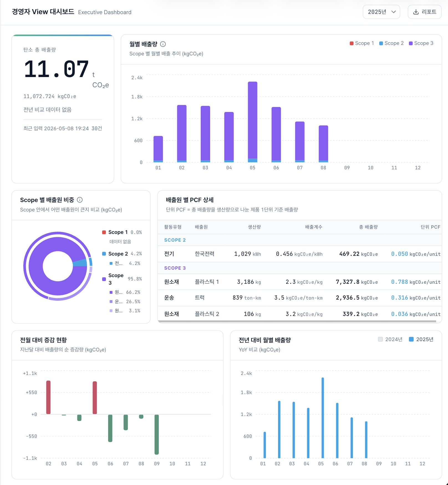
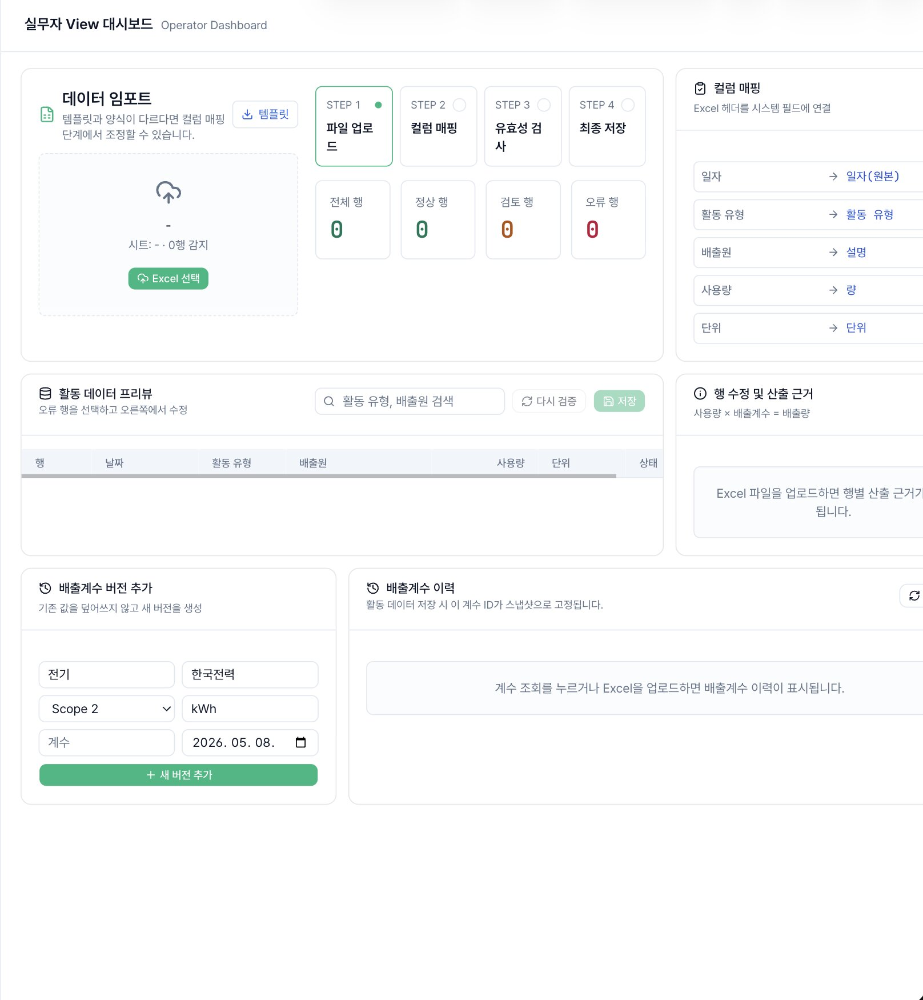
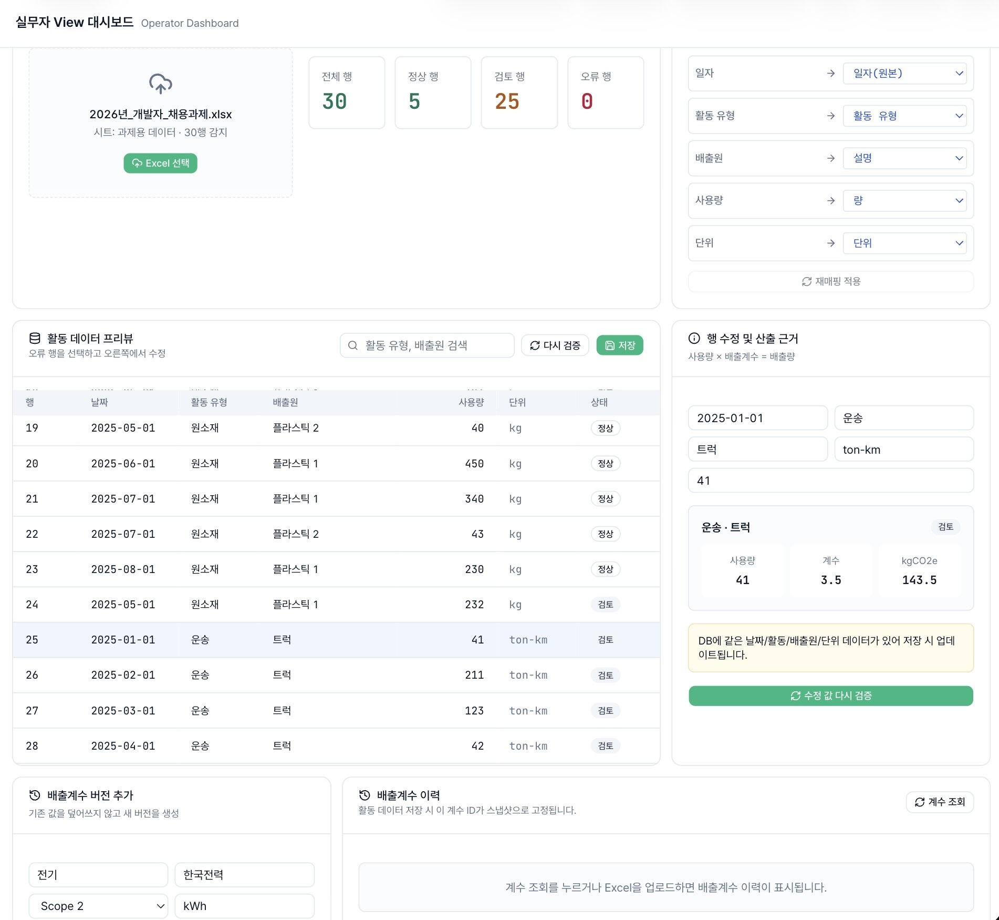
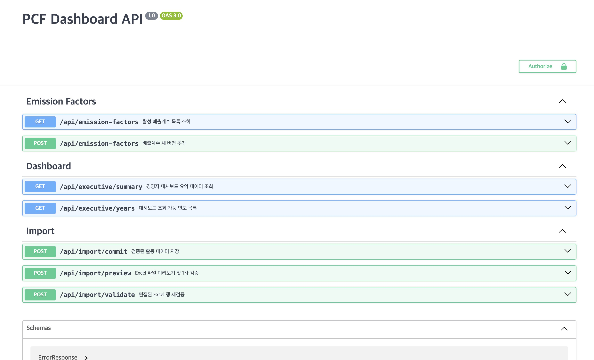

# UI 실행 과정

> 데모 영상 : [ui-demo-scenario.mov]("./ui-demo-scenario.mov")


## 1. 앱 실행

Docker Compose 기준으로 PostgreSQL과 Next.js 앱을 함께 실행합니다.

```bash
docker compose up --build
```

브라우저에서 `http://localhost:3000`에 접속합니다.

---

## 2. 경영자 대시보드 확인

접속 경로: `/`

확인 포인트:
- 연도별 총 배출량과 단위 PCF KPI
- Scope 1, 2, 3 기준 월별 배출 추이
- Scope별 배출원 비중
- 배출원별 총 배출량과 단위 PCF 상세
- 전월 대비, 전년 대비 배출량 변화

캡처 이미지:



---

## 3. 실무자 대시보드 확인

접속 경로: `/operator`

확인 포인트:
- 과제용 Excel 파일 업로드
- Excel 컬럼과 시스템 필드 매핑
- 업로드 데이터 미리보기
- 정상/경고/오류 상태 확인
- 행별 산출 근거와 입력값 수정
- 배출계수 버전 추가 및 이력 확인

캡처 이미지:



---

## 4. Excel import 흐름 확인

사용 파일: `2026년_개발자_채용과제.xlsx`

진행 순서:
1. `/operator`에서 Excel 파일 업로드
2. 컬럼 매핑 확인 후 적용
3. 유효성 검사 결과 확인
4. 오류 행이 있으면 우측 편집 영역에서 값 수정
5. 재검증 후 정상 데이터 DB 반영
6. `/`로 이동해 경영자 대시보드 지표 갱신 확인

캡처 이미지:



---

## 5. API 문서 확인

접속 경로: `/api-doc`

확인 포인트:
- Executive dashboard summary API
- Excel import preview/validate/commit API
- Emission factor 조회 및 버전 추가 API

캡처 이미지:



---
